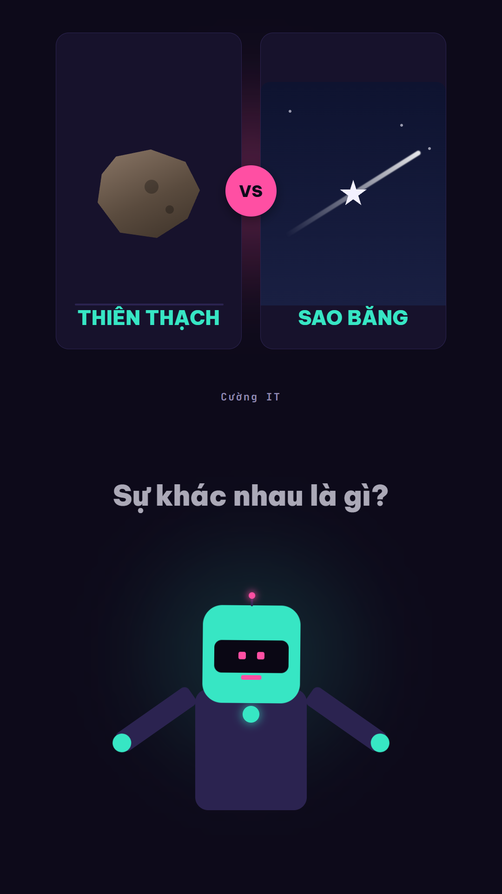
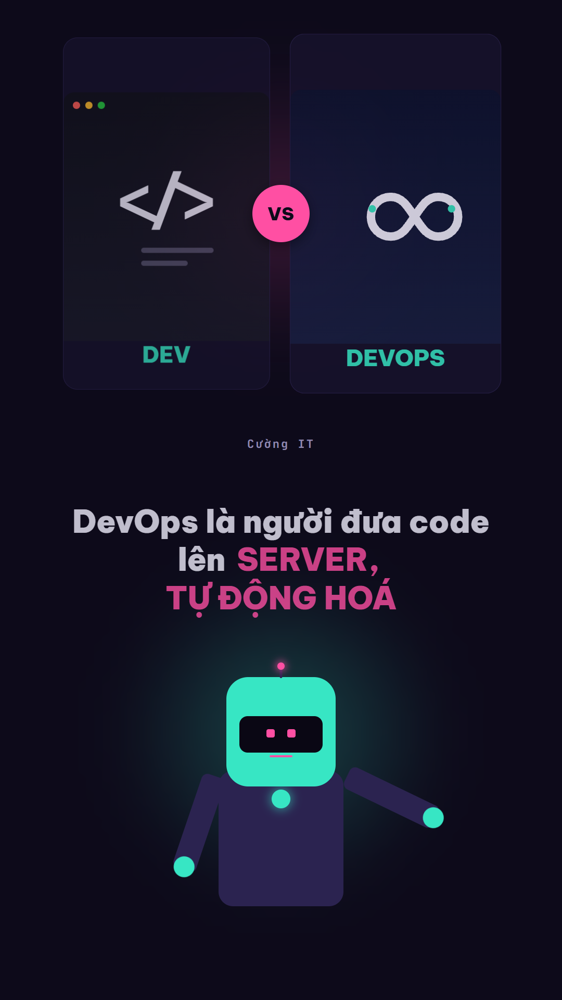

# Tạo Video Dạng So Sánh Kiến Thức — Comparison Video Template

**Template video giáo dục ngắn (TikTok/Reels/Shorts)** dựng trên **[HyperFrames](https://hyperframes.heygen.com)** — mỗi video so sánh một cặp khái niệm hay bị nhầm lẫn, theo đúng một layout/nhịp cố định, chỉ đổi nội dung.


## Mục lục

- [Xem trước](#-xem-trước)
- [Các video hiện có](#các-video-hiện-có)
- [Tính năng nổi bật](#-tính-năng-nổi-bật)
- [Bảng màu & thiết kế](#-bảng-màu--thiết-kế)
- [Cấu trúc repo](#-cấu-trúc-repo)
- [Yêu cầu hệ thống](#️-yêu-cầu-hệ-thống)
- [Bắt đầu](#-bắt-đầu)
- [Đóng góp](#-đóng-góp)
- [Xem thêm](#-xem-thêm)
- [License](#-license)

## 🎬 Xem trước

| Thiên thạch vs Sao băng | Dev vs DevOps |
| --- | --- |
|  |  |

Ảnh chụp trực tiếp từ composition hiện tại (`hyperframes snapshot`) — bảng màu tím-hồng-lục lam và avatar
robot 2D là giao diện **mặc định hiện hành** của cả series (xem [Bảng màu & thiết kế](#-bảng-màu--thiết-kế)).

Một số demo video ngắn dạng TikTok/Reels/Shorts đã xuất bản:

| Demo 1 | Demo 2 |
| --- | --- |
| [](https://www.youtube.com/shorts/PK-BZtdnkFU) | [](https://youtube.com/shorts/8ZfXTse5HFw) |
| ▶️ **[youtube.com/shorts/PK-BZtdnkFU](https://www.youtube.com/shorts/PK-BZtdnkFU)** | ▶️ **[youtube.com/shorts/8ZfXTse5HFw](https://youtube.com/shorts/8ZfXTse5HFw)** |

## Các video hiện có trong repo

| Video | Chủ đề | Thư mục |
|---|---|---|
| Thiên thạch vs Sao băng | Meteorite vs Meteor | [`videos/thien-thach-vs-sao-bang/`](videos/thien-thach-vs-sao-bang/) |
| Dev vs DevOps | "Dev xây, DevOps vận hành" | [`videos/dev-vs-devops/`](videos/dev-vs-devops/) |
| Kim Cương vs Than Đá | Diamond vs Coal (Cấu trúc & áp suất) | [`videos/kim-cuong-vs-than-da/`](videos/kim-cuong-vs-than-da/) |

## 📌 Tính năng nổi bật

- **Layout 3 phần chuẩn hóa** (xem chi tiết trong [`DESIGN.md`](DESIGN.md)):
  1. **Nửa trên** — 2 card minh họa đặt cạnh nhau bằng CSS/SVG (khái niệm A bên trái, B bên phải).
  2. **Phần giữa** — caption chạy chữ động, tô nổi bật từ khóa quan trọng bằng màu định sẵn.
  3. **Nửa dưới** — avatar MC robot 2D với 4 tư thế (chỉ tay trái, chỉ tay phải, nhún vai thắc mắc,
     giải thích), miệng/mắt LED nhấp nháy đồng bộ theo nhịp lời thoại.
- **Voiceover tự động** — hỗ trợ **2 TTS provider**: **Vbee TTS API** (chất lượng cao, cần tài khoản) và **[Edge TTS](https://github.com/travisvn/edge-tts-universal)** (miễn phí, không cần API key, pure Node.js). Dùng `ffprobe` đo độ dài thật từng câu để đồng bộ animation GSAP chính xác tới mili-giây (không ước lượng).
- **Font tiếng Việt chuẩn** — Be Vietnam Pro nhúng qua `@font-face` + `unicode-range`, không bị lỗi dấu như khi dùng font mặc định của compiler.
- **Nhiều video, 1 template** — mỗi video là một project HyperFrames độc lập trong `videos/`, dùng chung thiết kế/credentials, dễ nhân bản cho chủ đề mới.

## 🎨 Bảng màu & thiết kế

Toàn bộ hợp đồng layout/màu/font/motion nằm trong [`DESIGN.md`](DESIGN.md) — mọi video trong series
đều phải theo đúng bảng màu và cấu trúc 3-zone này để giữ nhận diện đồng nhất.

| Token | Hex | Vai trò |
| --- | --- | --- |
| `--bg` | `#0D0A1A` | Nền chính (đen ánh tím) |
| `--panel` | `#17122C` | Nền card minh họa |
| `--panel-edge` | `#2B2350` | Viền card / robot |
| `--fg` | `#F3F1FF` | Chữ chính |
| `--fg-dim` | `#9089B0` | Chữ phụ / label |
| `--accent-pink` | `#FF4FA3` | Từ khóa nổi bật, mắt/miệng robot |
| `--accent-cyan` | `#37E6C4` | Tên chủ đề, đầu robot, đèn ngực |

## 📁 Cấu trúc repo

```
auto-compare-video/
├── README.md, LICENSE                ← bạn đang ở đây
├── CLAUDE.md, AGENTS.md               ← hướng dẫn cho AI coding agent (Claude Code, Cursor...)
├── DESIGN.md                          ← hợp đồng layout/màu/font/motion — dùng chung mọi video
├── vbee.md                            ← tài liệu API Vbee TTS
├── docs/previews/                     ← ảnh preview tĩnh dùng trong README
├── .env                                ← Vbee credentials dùng chung (tự tạo, không commit)
├── .claude/skills/create-video/       ← skill Claude Code: tạo video mới theo đúng template
├── .agents/skills/create-video/       ← skill Antigravity: cùng quy trình, cho Antigravity / Antigravity CLI
└── videos/
    ├── thien-thach-vs-sao-bang/       ← 1 video = 1 project HyperFrames độc lập
    │   ├── package.json, hyperframes.json, meta.json, index.html
    │   ├── BRIEF.md                    ← brief riêng của video này
    │   ├── assets/vo/*.mp3, durations.json
    │   ├── scripts/generate-vo.mjs
    │   └── renders/, snapshots/        ← output, không commit
    ├── dev-vs-devops/                 ← cấu trúc tương tự
    └── <video-mới>/                   ← thêm video mới vào đây
```

Mỗi video trong `videos/` là một project HyperFrames **hoàn toàn độc lập** (`npm run dev/check/render/publish` riêng), chỉ dùng chung `.env` ở root và bộ quy tắc thiết kế trong `DESIGN.md`.

## 🛠️ Yêu cầu hệ thống
1. **AI coding agent** (Claude Code, Cursor, Codex v.v.) để gọi skill tạo video tự động).
2. **TTS provider** (chọn 1 trong 2):
   - **[Vbee TTS](https://vbee.vn/?aff=cuongit96)** — chất lượng cao, nhiều giọng Việt, cần tài khoản (App ID + Access Token).
   - **[Edge TTS](https://github.com/travisvn/edge-tts-universal)** — miễn phí, không cần API key, giọng Microsoft Neural. Đã tích hợp sẵn qua npm (`edge-tts-universal`), không cần cài gì thêm.
3. **Node.js** ≥ 18 — tải tại [nodejs.org/en/download](https://nodejs.org/en/download)
4. **FFmpeg & FFprobe** trong `PATH` — cần để đo độ dài audio và render video. Hướng dẫn cài đặt: [ffmpeg.org/download.html](https://ffmpeg.org/download.html) (Windows có thể dùng `winget install ffmpeg` hoặc `choco install ffmpeg`; macOS dùng `brew install ffmpeg`; Linux dùng `apt install ffmpeg`)


## 🚀 Bắt đầu

### 1. Thiết lập credentials (dùng chung cho mọi video)

Copy `.env.example` thành `.env` ở **thư mục gốc của repo**, rồi điền các biến môi trường:

```bash
cp .env.example .env
```

```env
TTS_PROVIDER=edge                    # "edge" (miễn phí) hoặc "vbee" (cần tài khoản)
EDGE_VOICE=vi-VN-NamMinhNeural      # giọng Edge TTS — nam: NamMinhNeural, nữ: HoaiMyNeural
CHANNEL=Cường IT                     # tên kênh hiển thị trên eyebrow tag
AUTO_CREATE_VIDEO=0                  # 0 = xác nhận từng bước | 1 = chạy tự động
```

> **Mặc định dùng Edge TTS (miễn phí)** — chạy hoàn toàn bằng Node.js (qua [`edge-tts-universal`](https://github.com/travisvn/edge-tts-universal)), không cần Python hay API key. Muốn dùng Vbee TTS (chất lượng cao hơn): đổi `TTS_PROVIDER=vbee` và thêm `VBEE_APP_ID`, `VBEE_ACCESS_TOKEN`, `VBEE_VOICE_CODE` — xem `.env.example` để biết đầy đủ.

`.env` không commit (đã có trong `.gitignore`) — chỉ `.env.example` được đưa lên repo làm mẫu.

### 2. Tạo video mới

Cách nhanh nhất — dùng **Claude Code**, gọi skill có sẵn kèm cặp khái niệm muốn so sánh, ví dụ:

```
/create-video Dev và DevOps
```

Chỉ cần lệnh này là skill tự động làm hết phần còn lại: hỏi/xác nhận lại cặp khái niệm + kịch bản
12 dòng (trừ khi `AUTO_CREATE_VIDEO=1` — xem bước 1), tự khởi tạo project, sinh giọng đọc VO, dựng
composition đúng theo `DESIGN.md`, và chạy `npm run check` — xem chi tiết trong
[`.claude/skills/create-video/SKILL.md`](.claude/skills/create-video/SKILL.md).

**Dùng Google Antigravity?** Skill tương đương đã có sẵn ở
[`.agents/skills/create-video/`](.agents/skills/create-video/) — clone repo về là Antigravity tự
nhận, không cần cài gì. Không cần gõ tên skill, chỉ cần nói bình thường:

```
Làm video so sánh Dev và DevOps
```

Xem [`.agents/skills/create-video/README.md`](.agents/skills/create-video/README.md) để biết cách
cài global cho mọi project và khác biệt so với bản Claude Code.

Không dùng AI agent nào ở trên, hoặc muốn tự chạy từng bước thủ công — làm theo phần dưới đây:

<details>
<summary>Các bước thủ công (không dùng skill)</summary>

**Sinh giọng đọc cho một video:**

```bash
cd videos/thien-thach-vs-sao-bang
node scripts/generate-vo.mjs
```

Tải audio về `assets/vo/*.mp3` và ghi độ dài thật vào `assets/vo/durations.json`.

**Preview / kiểm tra / render:**

Mọi lệnh chạy với thư mục hiện tại là **thư mục video** (vì `package.json` nằm ở đó):

```bash
cd videos/thien-thach-vs-sao-bang
npm run dev       # preview server (long-running)
npm run check     # lint + layout + motion + contrast
npm run render    # render ra renders/*.mp4
npm run publish   # xuất bản, lấy link chia sẻ
```

**Tạo video hoàn toàn mới (thay vì lặp lại video có sẵn):**

1. Tạo thư mục mới `videos/<ten-video-moi>/`, chạy `npx hyperframes@latest init` bên trong.
2. Copy cấu trúc HTML/CSS/timeline từ một video có sẵn, giữ nguyên hợp đồng layout trong `DESIGN.md` — chỉ đổi nội dung/icon/audio theo chủ đề mới.
3. Viết `BRIEF.md` riêng cho video đó (chủ đề, góc so sánh, kịch bản).
4. `node scripts/generate-vo.mjs` rồi `npm run check` trước khi coi là xong.

</details>

## 🤝 Đóng góp

Repo mở cho việc nhân bản/tuỳ biến. Nếu thêm video mới hoặc sửa template, giữ đúng layout 3-zone cố định trong `DESIGN.md` (đây là "hợp đồng" giúp cả series đồng nhất) — mọi thay đổi khác (chủ đề, kịch bản, icon) đều được hoan nghênh. Mở PR hoặc issue nếu bạn tìm thấy lỗi hoặc muốn đề xuất cải tiến.

## 🔗 Xem thêm

Xem các mẫu tạo video khác tại:

- Link repo tạo video từ 1 đường Link/Bài viết: 🔗 [github.com/Cuongyd196/auto-video-gen](https://github.com/Cuongyd196/auto-video-gen)
- 1 repo tương tự sử dụng Remotion: 🔗 [github.com/Cuongyd196/remotion-cuongit-template](https://github.com/Cuongyd196/remotion-cuongit-template)

Các video mẫu mình đã làm, các bạn có thể xem trong Reels hoặc TikTok:

- 📹 Facebook: [www.facebook.com/cuongit96/reels/](https://www.facebook.com/cuongit96/reels/)
- 📹 TikTok: [www.tiktok.com/@cuongit96](https://www.tiktok.com/@cuongit96)

Mình tạo nhóm này cho các bạn trao đổi về Làm Video với AI nhé.
Với các repo mình công khai, có vướng mắc mình sẽ giải đáp cho các bạn.

- 👥 Nhóm trên Facebook: [facebook.com/groups/1010029065373486](https://www.facebook.com/groups/1010029065373486/)
- 👥 Nhóm trên Zalo: [zalo.me/g/8bfeotyh5ewtkzxmp5gt](https://zalo.me/g/8bfeotyh5ewtkzxmp5gt)

Nếu hữu ích với các bạn thì cho mình 1 star GitHub nhé 🌟

Nếu muốn ủng hộ mình 1 ly cà phê: [buymeacoffee.com/cuongit96/gallery/4959449](https://buymeacoffee.com/cuongit96/gallery/4959449)

## 📄 License

[MIT](LICENSE) — tự do dùng, sửa, phát hành lại, chỉ cần giữ thông báo bản quyền.
